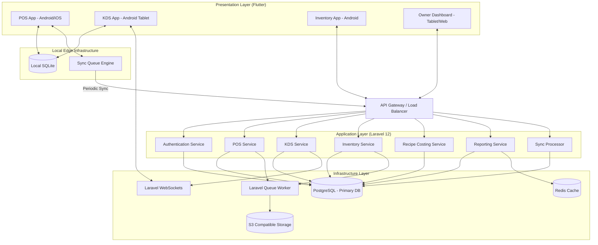
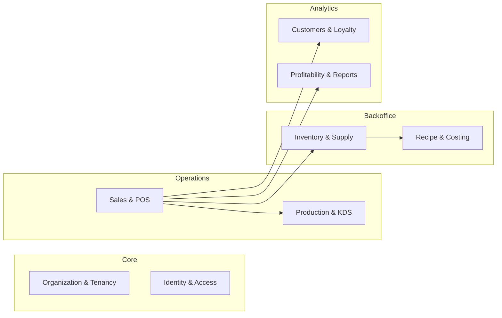

# Tjoerah POS - System Architecture

This document defines the high-level system architecture for the Tjoerah POS Enterprise F&B Operating System. The architecture is designed to scale up to 100+ outlets while remaining offline-first, real-time, and mobile-friendly.

## 1. High Level Architecture Diagram

## 2. Layered Service Architecture

The system utilizes a strict layered architecture pattern enforcing Domain-Driven Design (DDD).

### Layer 1: Presentation Layer
Built purely in **Flutter**, maintaining a single codebase to output Android, iOS, and Web (for the Owner Dashboard). 
- State management strictly separates UI state from domain models.
- Employs a local-first write pattern (modifications write to SQLite first, then sync).

### Layer 2: Application Layer (Laravel 12)
Exposes RESTful APIs and WebSocket channels. The Application Layer orchestrates the flow of data but contains no direct business logic. 
- **Services:** `PosService`, `InventoryService`, `CostingService`.
- Uses Jobs and Listeners to handle background tasks asynchronously.

### Layer 3: Domain Layer
Defines the business logic, constraints, and policies within isolated Bounded Contexts.
- **Entities:** Models mapping to core business logic.
- **Value Objects:** Money, TaxRate, Weight.
- **Repositories:** Abstract database access logic.

### Layer 4: Infrastructure Layer
Handles persistence, caching, queuing, and file storage.
- **Database:** PostgreSQL (with complex JSONB constraints for modifiers and history).
- **Cache:** Redis for reporting aggregations.
- **Queues:** Beanstalkd/Redis queue handling heavy background processes like costing.
- **Storage:** MinIO / AWS S3 for receipts, product images, and invoice attachments.

## 3. Module & Domain Boundaries

## 4. Sync Architecture (Offline-First)

**Decision:** The POS writes all operational transactions (Orders, Payments, Refunds) locally to **SQLite** first.
- A background `SyncQueue` job running in Flutter pushes payloads to the Laravel backend whenever an internet connection is detected.
- The Laravel `SyncController` handles upserts and conflict resolution.
- Orders have an absolute **Must-Sync (100%)** priority. Reference data (Product Catalog) syncs periodically via WebSockets or polling.

## 5. Realtime Architecture

**Decision:** Utilize Laravel Reverb or Soketi (WebSocket servers) to broadcast events.
- **KDS Screen:** Subscribes to `outlet.{id}.kds` channel. When an order is completed on the POS, Laravel broadcasts an `OrderCreated` event, updating the KDS without manual refresh.
- **Stock Alerts:** If inventory drops below threshold, WebSockets push an alert to the Outlet Manager's device.

## 6. Multi-Tenant & Multi-Outlet Strategy

**Decision:** Strict Tenant Isolation via Foreign Keys and Global Scopes.
- Every major table (`products`, `orders`, `employees`) possesses a `company_id` and `outlet_id`.
- **Global Scopes** in Laravel are applied automatically based on the authenticated user's token. 
  - *Outlet Manager* token automatically filters `WHERE outlet_id = ?`.
  - *Area Manager* token automatically filters `WHERE outlet_id IN (?, ?, ?)`.
- Products are stored centrally at the `company_id` level, but pricing and stock can be overridden at the `outlet_id` level using a `product_outlet_pricing` pivot table.

## 7. Security Architecture

- **Authentication:** JWT tokens via Laravel Passport/Sanctum with short expiry and refresh token rotation.
- **Authorization:** Granular RBAC (Role-Based Access Control) using Spatie Laravel-Permission.
- **PIN Logins:** Cashiers authenticate the device once with a JWT, but switch users locally using a 4-digit PIN for speed, with audit logs tracking the exact PIN user.
- **Audit Logging:** All financial and destructive actions (Refunds, Voids, Stock Adjustments) trigger a mandatory audit log entry detailing `user_id`, `action`, `previous_state`, and `new_state`.

## 8. Scalability & Deployment Strategy

**Decision:** Containerized Microservices Approach for Infrastructure.
- **Stateless Backend:** Laravel containers deployed via Kubernetes or Docker Swarm, scaling horizontally based on CPU load.
- **Database Scaling:** PostgreSQL Primary-Replica setup. Write-heavy operations hit the Primary. Read-heavy reports hit the Read Replica.
- **Queue Workers:** Dedicated queue worker pods handle Recipe Costing and Inventory Recalculation without impacting API response times for the POS.
