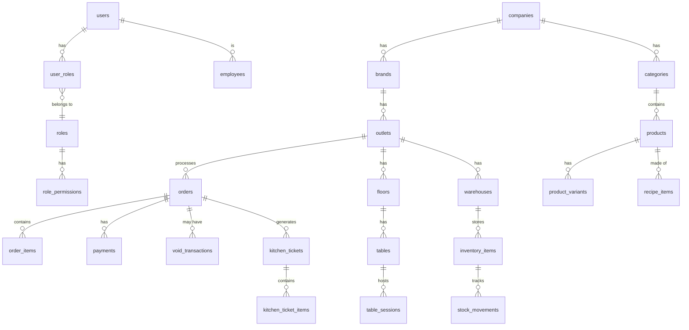

# Tjoerah POS - Database Schema Design

This document details the complete PostgreSQL database schema required for Tjoerah POS. The design supports a massive multi-outlet structure, complex recipe costing, KDS operations, and full offline-sync capabilities.

## 1. Entity Relationship Diagram (ERD) Overview

## 2. Table Definitions & Strategies

### Core Hierarchy
- **`companies`**: `id`, `name`, `tax_number`, `created_at`, `updated_at`, `deleted_at`
- **`brands`**: `id`, `company_id` (FK), `name`, `logo_url`
- **`outlets`**: `id`, `brand_id` (FK), `name`, `address`, `timezone`, `status`

### Authentication & Authorization
- **`users`**: `id`, `email`, `password_hash`, `pin_hash` (For fast cashier login), `is_active`
- **`roles`**: `id`, `name` (e.g., Owner, Area Manager, Outlet Manager, Cashier)
- **`permissions`**: `id`, `name` (e.g., `refund_transaction`, `void_item`)
- **`user_roles`**: `user_id`, `role_id`, `company_id`, `brand_id`, `outlet_id` (Allows scope-based RBAC)

### Employees
- **`employees`**: `id`, `user_id` (FK), `outlet_id` (FK), `name`, `phone`
- **`shifts`**: `id`, `employee_id`, `outlet_id`, `started_at`, `ended_at`, `starting_cash`, `ending_cash`
- **`attendance_logs`**: `id`, `employee_id`, `action` (check_in/check_out), `timestamp`, `photo_url`

### Products & Recipes
- **`categories`**: `id`, `company_id`, `name`, `color_code`
- **`products`**: `id`, `category_id`, `name`, `product_type` (simple/variant/modifier/bundle), `sku`, `base_price`
- **`product_variants`**: `id`, `product_id`, `name` (e.g., Large, Small), `sku`, `price_adjustment`
- **`modifiers`**: `id`, `product_id`, `name`, `price`
- **`recipes`**: `id`, `product_id`, `version_number`, `is_active`
- **`recipe_items`**: `id`, `recipe_id`, `inventory_item_id`, `quantity`, `unit`, `yield_percentage`, `waste_percentage`

### POS & Transactions
*Must support Offline-Sync by utilizing UUIDs generated by the client.*
- **`orders`**: `id` (UUID), `outlet_id`, `cashier_id`, `customer_id`, `order_type` (dine_in, take_away, delivery), `status`, `subtotal`, `tax`, `discount`, `total`, `created_at` (Client time), `synced_at` (Server time)
- **`order_items`**: `id` (UUID), `order_id`, `product_id`, `variant_id`, `quantity`, `price`, `discount`, `notes`
- **`payments`**: `id` (UUID), `order_id`, `payment_method` (cash, qris, cc, debit), `amount_tendered`, `amount_paid`
- **`refunds`**: `id` (UUID), `order_id`, `amount`, `reason`, `approved_by` (FK to employee_id)

### Kitchen Display System (KDS)
- **`kitchen_tickets`**: `id` (UUID), `order_id`, `station_type` (bar, kitchen), `status` (pending, preparing, ready), `priority`, `created_at`
- **`kitchen_ticket_items`**: `id` (UUID), `ticket_id`, `order_item_id`, `status`

### Inventory
- **`warehouses`**: `id`, `outlet_id`, `name`, `type` (central, outlet)
- **`inventory_items`**: `id`, `warehouse_id`, `name`, `sku`, `unit_of_measure`, `quantity`, `average_cost`
- **`stock_movements`**: `id`, `inventory_item_id`, `movement_type` (in, out, adjust, waste, consume), `quantity_changed`, `balance_after`, `reference_type` (e.g., 'order'), `reference_id` (e.g., order UUID)

### Suppliers & Purchases
- **`suppliers`**: `id`, `company_id`, `name`, `contact_info`
- **`purchase_orders`**: `id`, `supplier_id`, `warehouse_id`, `status` (draft, sent, received), `total_amount`
- **`goods_receipts`**: `id`, `purchase_order_id`, `received_date`, `invoice_url`

### Table Management
- **`floors`**: `id`, `outlet_id`, `name`
- **`tables`**: `id`, `floor_id`, `name`, `seats`, `status` (available, occupied, cleaning)

### Customers (CRM)
- **`customers`**: `id`, `company_id`, `name`, `phone`, `email`
- **`loyalty_points`**: `id`, `customer_id`, `points_balance`, `lifetime_points`

---

## 3. Indexing Strategy
- **Primary Keys:** Standard auto-increment `BIGSERIAL` for reference data. `UUID` (v4) for all operational/transactional data to prevent offline sync collisions.
- **Foreign Keys:** B-Tree indexes on all foreign keys (e.g., `outlet_id`, `product_id`) to speed up join operations and tenant scoping.
- **Search Indexes:** Trigram GiST indexes on `products.name` and `customers.phone` for lightning-fast cashier searches.
- **Time-Series Indexes:** BRIN (Block Range Index) on `orders.created_at` and `stock_movements.created_at` for fast reporting aggregations over time.

## 4. Partitioning Strategy
- **`orders` & `order_items`**: Partitioned by Range (`created_at` - monthly). This ensures that querying the current month's sales is extremely fast, while historical data is smoothly archived.
- **`stock_movements`**: Partitioned by Range (`created_at` - monthly) due to the massive volume of inserts expected from automatic recipe costing deductions.

## 5. Audit & Soft Delete Strategy
- **Soft Deletes:** Implemented across all reference data (`products`, `employees`, `categories`) using a `deleted_at` timestamp. This guarantees that historical orders linked to deleted products do not break.
- **Audit Logs:** A dedicated `audit_logs` table (or JSONB column depending on volume) capturing `table_name`, `record_id`, `action` (update/delete), `old_payload`, `new_payload`, `user_id`. Required for price overrides and stock adjustments.

## 6. Offline Sync Friendly Design
- Use `id` as `UUID` for all tables populated by the POS (Orders, Payments, Customers).
- Add `client_created_at` and `client_updated_at` to distinguish between when an event happened vs when it hit the server (`synced_at`).
- Use versioning (`version_number` integer, incremented on update) on `products` and `recipes` so the client knows when to pull updates.
