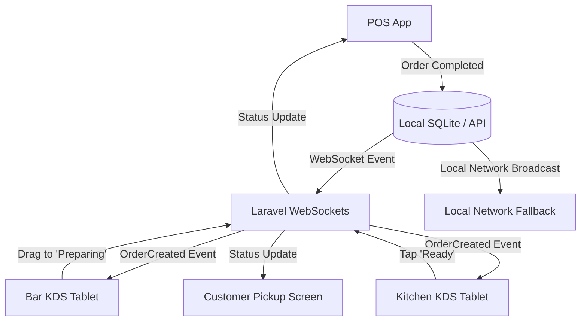

# Tjoerah POS - Kitchen Display System (KDS) Architecture

The Kitchen Display System (KDS) is the operational heart of the kitchen and bar. It transitions the business away from lost paper tickets and provides real-time SLA tracking for production performance.

## 1. KDS Architecture Diagram

## 2. Station Routing Engine

The system supports infinite, customized stations (Bar, Kitchen, Dessert, Packaging).
- Every `Product` is mapped to a specific `station_type`.
- Example: Order #1001 contains 1x Latte (Bar), 1x Burger (Kitchen), 1x Cheesecake (Dessert).
- **Behavior**: The KDS Routing Engine splits Order #1001 into three distinct `kitchen_tickets` and sends them *only* to the relevant tablets. The Bar tablet will not see the Burger.

## 3. Kanban Queue Management

The Tablet UI (Landscape preferred) utilizes a 4-column Kanban layout.

| Pending | Preparing | Ready | Completed |
| :--- | :--- | :--- | :--- |
| **Order #1001** Table: 4 1x Latte  *(Normal)* | **Order #1000** Table: 2 1x Americano  *(VIP)* | **Order #0998** Take Away 2x Mocha  *(Waiting Pickup)* | ... |

- **Interactions**: Baristas can drag and drop ticket cards between columns, or simply tap the card to advance its state.
- **Priority**: Tickets injected by the POS can carry tags: `Normal`, `VIP`, `Rush`. A manager on the POS can boost a ticket to `Rush`, moving it to the top of the KDS queue and turning the card border red.

## 4. SLA Monitoring Engine

Each category/product holds an expected SLA time (e.g., Espresso = 3 mins, Burger = 15 mins).

**Timer States**:
- **Green (Within SLA)**: `Elapsed Time < 75% of SLA`.
- **Amber (Approaching SLA)**: `Elapsed Time > 75% of SLA`. Ticket card pulses softly.
- **Red (Exceeded SLA)**: `Elapsed Time > 100% of SLA`. Ticket turns solid red, triggering a continuous audio alert.

## 5. Offline Fallback & Realtime Design

- **Primary**: Laravel WebSockets (Reverb/Soketi) for instant updates without polling.
- **Offline Fallback**: If internet goes down, the POS app can broadcast UDP packets or run a tiny local HTTP server to push tickets directly to the KDS tablets on the same local Wi-Fi network.
- **Reconciliation**: When KDS operators change statuses offline, it saves to the local KDS SQLite DB and syncs to the Laravel backend once internet returns, ensuring accurate SLA reports.

## 6. Audio Alerts

The KDS emits distinct, configurable sounds:
1. **New Ticket**: Standard pleasant chime.
2. **Rush Ticket**: Urgent double-chime.
3. **Overdue (Red SLA)**: Persistent alarm loop until acknowledged (tapped).
4. **Ready Ticket**: (Optional) Used if the KDS tablet faces front-of-house staff to notify them food is ready for pickup.

## 7. Reporting Architecture

The KDS generates crucial performance data:
- **Average Prep Time**: `Preparing_At` minus `Accepted_At`.
- **Average Completion Time**: `Ready_At` minus `Pending_At`.
- **SLA Compliance Rate**: Percentage of orders completed before the Red SLA threshold.
- **Station Performance**: Identifies bottlenecks (e.g., "The Kitchen averages 18 mins on weekends, but the Bar averages 4 mins").
