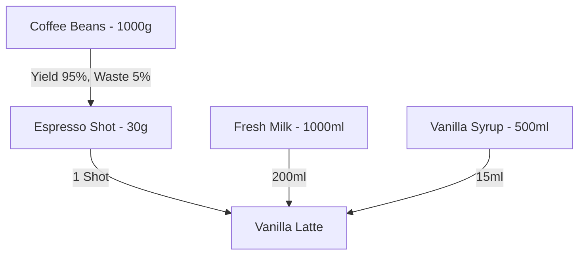

# Tjoerah POS - Inventory & Recipe Costing Architecture

This engine ensures that every sale impacts inventory and Cost of Goods Sold (COGS) in real time. It links the Point of Sale directly to back-office accounting, enabling strict cost control across 100+ outlets.

## 1. Inventory Architecture & Multi-Warehouse

Every physical location possesses at least one `Warehouse` (e.g., Outlet A Warehouse). Larger organizations can utilize a `Central Warehouse` for bulk purchasing and subsequent `Stock Transfers` to outlets.

### Stock Movement Tracking
Every single change to inventory generates an immutable `StockMovement` record.
- **Before Quantity** -> **After Quantity**
- **Movement Type**: `In` (Purchased), `Out` (Sold), `Transfer`, `Adjust`, `Waste`, `Consume` (Used in a recipe), `Produce` (Semi-finished good generated).
- **Audit**: Tied to the `user_id` and an optional `reference_id` (like an Order UUID).

## 2. Recipe Architecture & Yield Management

Recipes define how Raw Materials convert to Finished Products.

### Yield & Waste Calculation Engine
- **Yield**: If a 1000g bag of coffee beans only produces 950g of usable beans after grinding calibration, the Yield is 95%. The system factors this into the true cost per gram.
- **Waste Tracking**: Employees log daily waste (e.g., 200ml of expired milk). This subtracts from inventory, but instead of COGS, it is logged financially under `Spoilage/Waste Cost`.

### Recipe Versioning
Recipes are never mutated directly. If a recipe changes, a new `RecipeVersion` is created.
- **Why?** If you change the Vanilla Latte recipe today, historical profit reports from last month must use the old recipe costs, otherwise historical margins will retroactively distort.

## 3. Cost Calculation Engine (Weighted Average Cost)

Tjoerah POS uses the **Weighted Average Cost** method as the default, recalculated automatically upon `Goods Receipt`.

**Formula Example**:
1. Current Stock: 10kg Coffee @ Rp 200.000/kg (Total Value: Rp 2.000.000)
2. New Purchase: 5kg Coffee @ Rp 220.000/kg (Total Value: Rp 1.100.000)
3. New Stock: 15kg. Total Value: Rp 3.100.000.
4. **New Average Cost**: Rp 206.666/kg.

When the new average cost is calculated, the system triggers a `CostRecalculationJob` on the Laravel Queue to update the COGS of *every* recipe containing Coffee Beans.

## 4. Auto Inventory Deduction Flow

1. POS Completes Order for 1x Vanilla Latte.
2. Background Sync pushes to Laravel API.
3. API fires `OrderCompleted` event.
4. Laravel Queue picks up the event.
5. Looks up Active Recipe Version for Vanilla Latte.
6. Generates 3 `StockMovement` records (Out):
   - `-30g` Coffee Beans
   - `-200ml` Fresh Milk
   - `-15ml` Vanilla Syrup
7. Calculates total COGS based on current `average_cost` of those three ingredients.
8. Writes COGS to the `order_items` record for profit tracking.

## 5. Approval Workflow for Adjustments

To prevent theft masking, `Stock Adjustments` (manual overwrites of stock quantities) require a structured flow.
- A Cashier counts stock and proposes an adjustment (Stock Opname).
- State becomes `Pending Approval`.
- An Outlet Manager or Owner receives an alert, reviews the variance and financial impact, and hits `Approve`.
- Only upon approval are the actual `StockMovement` records created.

## 6. Offline Capabilities

- The POS downloads an *Inventory Snapshot* daily to allow offline operations.
- If the POS goes offline, it continues selling. However, exact inventory deductions are deferred until the POS syncs its orders to the Laravel Backend, which acts as the ultimate source of truth for stock levels.
